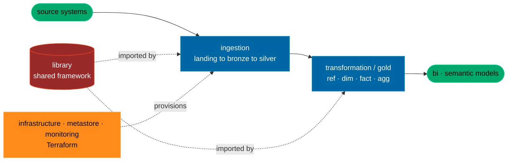
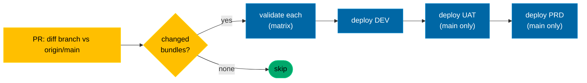

# Data platform: architecture & repo layout

Vendor-neutral. Distilled from a production medallion platform; the **shapes are
the contract**, names are examples.

## Polyrepo vs monorepo (decide consciously)
The reference platform is **polyrepo**: one git repo per concern (nine of them),
each independently deployable with the same uniform shape. The
demo scaffold collapses these into **one tree (a monorepo
demo)** so you can see the whole shape at once and start fast.

- **The unit of "repo layout"** is the *per-repo uniform shape* below, it's
  identical whether each concern is its own repo or a top-level folder.
- **Going to production:** lift each top-level folder (`ingestion/`,
  `transformation/`, `library/`, `infrastructure/`, …) into its own repo, or keep
  the monorepo and scope CI per folder. Either works; the layout doesn't change.

## The concerns (repos / top-level folders)



| Repo / folder | Responsibility |
|---|---|
| `ingestion` (jobs) | One **bundle per source system**; each runs `landing → bronze → silver`. |
| `transformation` (gold) | The dimensional model + the orchestration DAG. |
| `library` | The shared Python framework everything imports (versioned, built as a wheel). |
| `infrastructure` | Terraform for compute, storage, networking. |
| `metastore` | Catalog / schemas / grants (governance as code). |
| `monitoring` | Data-quality + cost/SLA monitoring. |
| `cicd` | Reusable pipeline templates referenced by every repo. |
| `bi` | Reports + semantic models, versioned as code. |
| `wiki` | "Way of working" docs (this skill is the portable version). |

## Per-repo uniform shape
Every repo carries the same skeleton, predictability is the point:
```
<repo>/
├── README.md
├── .gitignore
├── deployment/              # CI entrypoint + reusable steps/jobs + per-env conf
│   ├── <ci-pipeline>.yaml
│   ├── jobs/  steps/  conf/
└── services/               # data-platform repos that own infra
    ├── terraform/
    └── variables/
```

### ingestion: internal structure
```
ingestion/
├── _common/                # shared deploy config (targets, clusters, libraries,
│   │                       #   permissions, notifications, schedule): NOT a bundle
└── <source_system>/        # one bundle per source; folder name = bundle name
    ├── conf/requirements.txt
    ├── <bundle-manifest>.yaml   # name + artifacts + include _common/* + resources/*
    ├── resources/job.yaml       # the schedule/task wiring for this bundle
    └── src/
        ├── landing/{__init__.py, main.py, landing.py}
        ├── bronze/ {__init__.py, main.py, bronze.py}
        └── silver/ {__init__.py, main.py, silver.py}
```
Rules: a folder = a deployable bundle **unless it starts with `_`**. `main.py` is a
thin entrypoint; `<layer>.py` holds the processor class.

### transformation (gold): internal structure
```
transformation/
├── tasks/
│   ├── ref/   <table>.py + <table>.yaml      # 2 files per table, same basename
│   ├── dim/   <table>.py + <table>.yaml
│   ├── fact/  <table>.py + <table>.yaml
│   └── agg/   <table>.py + <table>.yaml
├── orchestration/
│   └── tasks.yaml          # the DAG: schema → table: [deps], alphabetical
└── bundles/
    ├── _template_task/     # the canonical task skeleton to copy
    ├── _common/
    └── orchestrate_*/      # the deployable orchestration bundle(s)
```

### library: internal structure
```
library/
└── src/<pkg>/
    ├── core/    task.py (the Task ABC), logger.py, data_classes.py
    ├── silver/  scd2_processor.py, …
    ├── gold/    gold_task.py, gold_writer.py, hist_*.py, …
    └── utils/   schema_utils.py, delta_utils.py, data_validation.py,
                 metadata_utils.py, incremental.py
```
The `Task` ABC owns session, logger, arg-parsing (`--environment`, `--job_run_id`,
`--task_run_id`, `--job_start_time`), YAML config loading, and run metadata; a
child implements one `launch()`. `GoldTask` adds the surrogate key + writes via the
YAML sidecar. Keep this package the *only* place engine-specific glue lives, so
swapping engines is a library change, not a per-task change.

## Deployment flow

Only changed bundles flow through (post-merge, diff `HEAD` vs `HEAD^`). Per-CI
mechanics (Azure dynamic matrix · GitLab `rules:changes` · GitHub `paths`) are in
[`adapters.md`](adapters.md).
