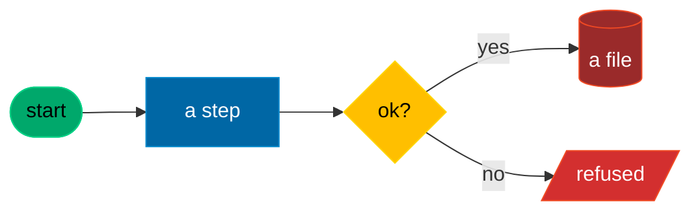

# Mermaid diagrams in the house subset

Every diagram here is a Mermaid `flowchart` in a house subset of the ISO 5807:1985 flowchart symbols, one colour per symbol, with a legend. Architecture views follow ISO/IEC/IEEE 42010:2022 (stakeholders, concerns, viewpoints, views), with C4 context, container and component as the presentation. `docs/diagrams/README.md` is the reference and holds the review checklist; the conventions block at the top of `docs/DESIGN.md` is the same table.

## The six shapes

| Shape | Mermaid | ISO 5807 meaning | Class | Colour |
|---|---|---|---|---|
| Stadium | `id(["text"])` | terminator: start or end | `term` | green |
| Rectangle | `id["text"]` | process: a step | `proc` | blue |
| Rhombus | `id{"text"}` | decision: a branch | `dec` | yellow |
| Parallelogram | `id[/"text"/]` | input or output | `io` | orange |
| Cylinder | `id[("text")]` | data store: file, config, database | `store` | dim red |
| Parallelogram, red | `id[/"text"/]` | stop: blocked, refused, escalated | `stop` | red |

Paste the classDef block verbatim so colours match everywhere, and give each node its class on a `class` line after the edges:

Legend: green terminator, blue process, yellow decision, dim red data store, red stop.

## Rules

- A legend line directly under every diagram in a Markdown file, naming only the classes it uses; in a `.mmd` source, a `%% Legend:` comment line.
- A dotted edge (`-.->`) is read-only access, and nothing else.
- Every node carries one of the six classes; no other colours, no inline `style`.
- One idea per diagram, about fifteen nodes at most. Split rather than shrink.
- A file name carries a date in ISO 8601 basic form when it needs one (`20260925`).

## The portable subset (avoid silent breaks)

- Quote every label that holds spaces, `()`, `:`, `/` or `#`: `A["text (x)"]`.
- Escape `<` and `>` as `&lt;` and `&gt;`; use ` ` for a line break.
- Never put `|` inside a node label; it is edge-label syntax. Write "or".
- Prefer `class` lines over inline `:::class` on a node that also has an edge on the same line.
- Use `flowchart`, not the older `graph`. Quote `subgraph` titles.
- Avoid features that renderers disagree on (mindmap, timeline, the `@{ }` shape shorthand).
- For structure rather than process, `sequenceDiagram`, `stateDiagram-v2`, `classDiagram` and `erDiagram` are allowed; they still get a legend line when they use colour.

## Prove it renders

Rendering proves syntax only; the reviewer checks the meaning against the checklist in `docs/diagrams/README.md`.

- `just diagrams-render` renders every `docs/diagrams/*.mmd` and every fenced mermaid block under `docs/` with the mermaid-cli version pinned in `mise.toml`, into a scratch folder, and refreshes `docs/diagrams/render.lock`. It needs node.
- `just diagrams-check` holds the sources to the lock without node: an edited diagram that was not rendered again is named.
- Commit the source and the refreshed lock, never an SVG.
