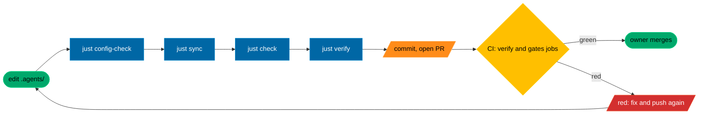

# Quickstart

How to get TAC running, and where to change things. For the full picture read [docs/DESIGN.md](docs/DESIGN.md); this page is the short way in.

## The one idea

TAC (toms-agent-config) is a harness for coding agents that works across providers. You describe how agents may work once, in the [`.agents/`](.agents/) tree. `tac sync` renders every harness's own files from it ([`AGENTS.md`](AGENTS.md), [`CLAUDE.md`](CLAUDE.md), [`.claude/`](.claude/), [`.codex/`](.codex/)) and records a hash of each in [`.agents/generated.lock`](.agents/generated.lock). `tac check` and CI then refuse anything that drifts from it (the hooks join them in milestone M2). So: **edit `.agents/`, run `just sync`, and let the gates prove it.** The one file you start from is [`.agents/config.toml`](.agents/config.toml); every other TOML file under [`.agents/config/`](.agents/config/) is a table it points at.

## First ten minutes

You need git and [just](https://just.systems). `bootstrap.sh` installs uv if it is missing. Run these from the repository root, in order.

| Step | Command | What you should see |
|---|---|---|
| 1. Pin the CLIs (optional, needs [mise](https://mise.jdx.dev); skip it if you already have uv and just) | `mise trust && mise install` | uv and just at the versions in [`mise.toml`](mise.toml). |
| 2. Build both environments | `bash bootstrap.sh` (or `just setup`) | `==>` steps for uv, the candidate `.venv`, the deployed `.agents/.venv`, then a `tac doctor` run. Safe to rerun. Outside an agent session it also builds the runner's own venv. |
| 3. The full gate | `just verify` | actionlint, shellcheck, ruff, basedpyright, pytest and the private scan, all green (about two minutes; one test is marked xfail until milestone M2 wires the hooks). |
| 4. Health checks | `just doctor` | One `PASS`, `FAIL` or `UNKNOWN` line per named check, then `N of 17 checks pass`. **It exits non-zero on a fresh checkout**: `runner-pub` fails and `github-ruleset` shows `FAIL` or `UNKNOWN` until the owner-only steps in [TODO.HUMAN.md](TODO.HUMAN.md) are done; `client-claude`, `client-codex`, `trust-claude` and `trust-codex` fail until each CLI is installed and has trusted this folder; inside an agent session `session-identity` can show `FAIL` or `UNKNOWN`, and `github-ruleset` and `session-identity` show `UNKNOWN` when your origin is a fork or a local clone. The rest should pass. |
| 5. The whole configuration | `just config-show` | About 300 lines of `key = value    # file:line`, every effective value and where it came from. |
| 6. One key, explained | `just explain profile.active` | The value, the file and line, when it applies and its comment. Try `just explain roles.chief` for a role's model, effort and launch command. |
| 7. Generated files are current | `just check` | `generated files match the lock`. |

`just` on its own lists every recipe with a one-line description.

## How a change travels

Legend (the house subset of ISO 5807 in [docs/DESIGN.md](docs/DESIGN.md)): green stadium = start or end, blue rectangle = a step, yellow rhombus = a decision, orange parallelogram = input or output, red parallelogram = stop. Before you commit, run `just verify` and `just check` (which already includes `just pipeline-check`). CI's `verify` job runs the same lints, types and tests, then `tac check` and `tac pipeline check` from the deployed toolchain; `just verify` runs neither of those two, so a change can pass it and still fail CI. CI's `gates` job judges the pull request with the base revision's scripts (private scan, work orders, the floor, receipts). The CI file is [`.github/workflows/ci.yml`](.github/workflows/ci.yml).

Agent sessions cannot write `.agents/` ([`policy.paths.deny_write`](.agents/config/policy.toml)), and every path under it is owner-reviewed, so a change there is the owner's own edit through a pull request.

## Where to tweak

Every key below resolves with `just explain <key>`. A table name (such as `standards.commits`) prints every key under it. After any edit, `just config-check` first: unknown keys and wrong types fail loudly.

Every `.toml` file under `.agents/config/` (not the runner's public key), plus `.agents/config.toml`, `.agents/standards.floor.toml` and `.agents/context/`, is hashed in the lock. After any edit there, run `just sync` and then `just check`, even when nothing rendered changes, or CI's `verify` job fails.

Some keys are validated today but read by no code until a later milestone (M2 or M3); the table says so where it applies. Changing one of those changes only the lock hash.

| I want to... | Edit | Key(s) | Then run |
|---|---|---|---|
| Change a role's model or effort | [`.agents/config/models.toml`](.agents/config/models.toml) | `models.roles.builder.anthropic.model`, `models.roles.builder.anthropic.effort` (same shape for `reviewer` and `manager`; `scout` on Anthropic has a model only, since Haiku 4.5 takes no effort; `.openai.` for Codex) | `just explain roles.builder`, `just sync`, `just check` |
| Turn the chief's ultracode on or off | [`.agents/config/models.toml`](.agents/config/models.toml) | `models.roles.chief.anthropic.ultracode`, `models.roles.chief.anthropic.effort` | `just explain roles.chief` (prints the launch command `just chief` uses), `just sync` |
| Change a board seat | [`.agents/config/models.toml`](.agents/config/models.toml), [`.agents/config.toml`](.agents/config.toml) | `models.directors.fable.model`, `governance.directors`. Each harness's director agent file takes that provider's lead seat, or its first seat when the provider has no lead: today `fable` for `.claude/agents/director.md` and `astra` for `.codex/agents/director.toml`. Changing `opus` changes no rendered file. What a builder or reviewer runs is `models.roles.<role>.<provider>.model` (row above); `models.providers.anthropic.build` is validated now but not rendered yet | `just config-check`, `just sync`, `just check` |
| Switch profile (enterprise, standard, yolo) | [`.agents/config.toml`](.agents/config.toml) | `profile.active` (only `standard` is supported in release 1; see the note below) | `just config-check`, `just sync`, `just check` |
| Adjust what a profile allows | [`.agents/config/profiles/standard.toml`](.agents/config/profiles/standard.toml) (also [`enterprise.toml`](.agents/config/profiles/enterprise.toml), [`yolo.toml`](.agents/config/profiles/yolo.toml)) | `profile.claude.defaultMode` (rendered into `.claude/settings.json`); `profile.review` and `profile.local_checks` are validated now, read from M3 | `just config-check`, `just sync`, `just check` |
| Set the project kind and its gate pack | [`.agents/config.toml`](.agents/config.toml), [`.agents/config/gates/`](.agents/config/gates/) (for example [`tool.toml`](.agents/config/gates/tool.toml)) | `project.kind`, `gates.tool.checks` | `just config-check`, then each gate's recipe (for `tool`: `just gate-cli-smoke`, `just gate-wheel`); a pack's `argv` must name a recipe in the [`justfile`](justfile). Nothing checks that yet, so run each recipe once by hand. Then `just sync`, `just check` |
| Add or change a role | [`.agents/config/roles/`](.agents/config/roles/) (one file per role, for example [`builder.toml`](.agents/config/roles/builder.toml)) plus its `[roles.<name>]` table in [`models.toml`](.agents/config/models.toml) | `roles.builder.instructions`, `roles.builder.may`, `roles.builder.may_not` | `just config-check`, `just sync` (writes `.claude/agents/<role>.md` and `.codex/agents/<role>.toml` for each harness the role has a seat on in `models.toml`), `just check` |
| Change teams and who owns which paths | [`.agents/config/teams.toml`](.agents/config/teams.toml), [`.agents/config.toml`](.agents/config.toml) | `teams.core.owns`, `teams.core.max_workers`, `teams.core.skills`, `teams.max_local_agents`, `work.base` | `just config-check`, `just work-validate`, `just sync`, `just check` |
| Change project standards | [`.agents/config/standards.toml`](.agents/config/standards.toml) | `standards.versioning.scheme` (semver), `standards.changelog.format`, `standards.commits.convention`, `standards.commits.max_subject`, `standards.dates.format` (ISO 8601), `standards.diagrams.tool`, `standards.diagrams.flowcharts` (Mermaid norms), `standards.code.markdown.em_dashes`. A value looser than the floor in `.agents/standards.floor.toml` is not an error: the floor wins, and `just explain <key>` shows which file won. To go looser, change the floor, which the base check refuses. Validated, merged with the floor and shown by `just explain` now; no gate checks a commit or a file against them until the M2 hooks (commit-msg, pre-commit) | `just config-check`, `just explain standards.commits`, `just sync`, `just check` |
| Tighten the standards floor | [`.agents/standards.floor.toml`](.agents/standards.floor.toml) | `floor.commit_max_subject`, `floor.em_dashes`. A waiver (`[[waivers]]`, `approved_by = "owner"`, an `expires` date) will lift a gate until that date once the M2 hooks enforce the floor (today `just config-check` only refuses an expired or non-owner waiver); the base comparison does not refuse one, the owner's review does | `just config-check origin/main` (refuses any floor key that loosens or disappears), `just sync`, `just check` |
| Change a pipeline | [`.agents/config/pipelines/`](.agents/config/pipelines/) (for example [`order.toml`](.agents/config/pipelines/order.toml)), [`.agents/config.toml`](.agents/config.toml) | `pipelines.enabled` (the pipelines whose files must exist; `tac run` in M3 will run only these). Stages themselves have no `explain` key. Removing a name from `enabled` does not turn a pipeline off: `just pipeline-check` still checks every file present. To remove a pipeline today, delete its file and its name from `enabled` | `just pipeline-check`, `just pipeline-plan order`, `just sync`, `just check` |
| Change the hook guard and its checks | [`.agents/config/hooks.toml`](.agents/config/hooks.toml) | `hooks.guard`, `hooks.checks.owned-paths`, `hooks.git.pre_commit` | `just config-check`, `just sync`, `just check`; the hooks are wired into the harness files from milestone M2 (today `.claude/settings.json` has `"hooks": {}`) |
| Allow an MCP server | [`.agents/config/mcp.toml`](.agents/config/mcp.toml) | `mcp.servers`, `mcp.strict` (validated now; nothing renders MCP config yet, headless stages read it from M3) | `just config-check`, `just sync`, `just check`. A server is loaded only while the profile says `profile.mcp_servers = "from-conf"` (standard does); config-check does not cross-check the two |
| Allow a host for agent commands | [`.agents/config/network.toml`](.agents/config/network.toml) | `network.egress.allow` (rendered for Claude only; Codex command networking stays off) | `just sync` (renders the Claude sandbox's allowed domains), `just check` |
| Change what no agent may read, write or do | [`.agents/config/policy.toml`](.agents/config/policy.toml) | `policy.paths.deny_read`, `policy.paths.deny_write`, `policy.effects.owner_only` | `just sync`, `just check`; the change is the owner's own edit under CODEOWNERS review (an agent proposal to loosen policy is what `governance.board_triggers` sends to the board) |
| Change which receipts a PR must carry | [`.agents/config/receipts.toml`](.agents/config/receipts.toml), [`.agents/config/probes.toml`](.agents/config/probes.toml) | `receipts.required`, `receipts.stages.verify`, `probes.version` | `just config-check`, `just sync`, `just check`; CI reads the base revision's copy, so it applies from the next pull request |
| Change runtime folders and passed-through variables | [`.agents/config/runtime.toml`](.agents/config/runtime.toml) | `runtime.paths.worktrees`, `runtime.env.pass` (validated now, read from M3 by `tac launch`) | `just config-check`, `just sync`, `just check` |
| Change the agents' GitHub identity | [`.agents/config.toml`](.agents/config.toml) | `governance.agent_identity` (the machine account `tac github apply` and `tac doctor` check). [`.agents/config/github.toml`](.agents/config/github.toml) is validated but not yet read; the merge method is fixed at squash, and the ruleset itself is built in [`src/tac/github.py`](src/tac/github.py) | `just config-check`, `just sync`, `just check`; the ruleset is applied by the owner on the host (`just github-apply`, see [TODO.HUMAN.md](TODO.HUMAN.md)), then `just doctor` |
| Change usage limits or which harnesses are enforced | [`.agents/config.toml`](.agents/config.toml) | `harnesses.enforced`, `harnesses.instructions_only`; `usage.claude.slow_at` is validated now, read from M3 by `tac usage` | `just config-check`, `just sync`, `just check` |
| Change the prompt a handoff sends | [`templates/handoffs/`](templates/handoffs/) (for example [`build.md.j2`](templates/handoffs/build.md.j2)); schemas in [`contracts/handoffs/`](contracts/handoffs/) | none: the first line names the contracts it reads and writes, and must agree with the pipeline stage | `just pipeline-check`, `just test-one tests/test_handoff.py` |
| Change what each harness gets | [`templates/adapters/claude/`](templates/adapters/claude/), [`templates/adapters/codex/`](templates/adapters/codex/), [`templates/adapters/common/`](templates/adapters/common/) | none: the first line of each template names its output, which must be on the `ALLOWED` list in [`src/tac/sync.py`](src/tac/sync.py) (a new output path is a `src/tac/` change) | `just sync`, `just check` |
| Change the context every agent reads | [`.agents/context/brief.md`](.agents/context/brief.md) (the body of `AGENTS.md`), [`.agents/context/claude.md`](.agents/context/claude.md) (Claude-only notes in `CLAUDE.md`) | none | `just sync`, `just check` |
| Add or change a skill | [`.agents/skills/`](.agents/skills/) (one folder with a `SKILL.md`, for example [`work-order`](.agents/skills/work-order/SKILL.md)) | `teams.core.skills` gives it to a team; a pipeline stage's `skills` list gives it to a stage | `just sync` (links it into `.claude/skills/`), `just pipeline-check` |
| Change the work order templates | [`work/templates/`](work/templates/) (the goal, report, review and sign-off files you copy by hand; [`work/orders/example/`](work/orders/example/) is the reference order) | none. The `order.toml` that `just work-new` writes comes from `ORDER_TEMPLATE` in [`src/tac/work.py`](src/tac/work.py); changing it is a change to `src/tac/`, which the owner then stamps | `just work-validate` |

Two notes on profiles. Release 1 supports the `standard` profile only; `enterprise` and `yolo` arrive in release 1.1 ([ADR 0002](docs/adr/0002-owner-decisions-2026-09-25.md)). `enterprise` passes `just config-check` and renders today, but its container isolation arrives in release 1.1, and on your own machine its render changes `.claude/settings.json`: `defaultMode` becomes `default` (a prompt for every edit), `Agent` and `Task` join its deny list (no subagents), and `disableBypassPermissionsMode` is dropped. Switch to it only to preview the render, then switch back. `yolo` is meant only for a disposable container. Nothing refuses it on your machine yet (config-check passes and sync renders `bypassPermissions` with the sandbox off), so do not switch to it there.

## Do not hand-edit

| Path | Why | Change it by |
|---|---|---|
| [`AGENTS.md`](AGENTS.md), [`CLAUDE.md`](CLAUDE.md), [`.claude/settings.json`](.claude/settings.json), [`.claude/agents/`](.claude/agents/), [`.codex/config.toml`](.codex/config.toml), [`.codex/agents/`](.codex/agents/) | Rendered by `tac sync`, listed under `[outputs]` in [`.agents/generated.lock`](.agents/generated.lock). `just check` fails on a hand edit. | Editing `.agents/` or `templates/adapters/`, then `just sync`. |
| [`.agents/generated.lock`](.agents/generated.lock) | Written by `tac sync`: the hash of every input, template and output. | `just sync`. |
| [`.agents/lib/tac/`](.agents/lib/tac/) | The stamped copy of [`src/tac/`](src/tac/) that the deployed checker runs from. | Changing `src/tac/`; the owner refreshes the copy on the host with `just stamp-lib`. |
| [`contracts/config/`](contracts/config/), [`contracts/envelope.schema.json`](contracts/envelope.schema.json), [`contracts/human-item.schema.json`](contracts/human-item.schema.json), [`contracts/receipt.schema.json`](contracts/receipt.schema.json) | JSON Schemas generated from the models in [`src/tac/`](src/tac/); every config file is held to them. | Changing the model in `src/tac/`, then `uv run --frozen tac config schema --write`, `uv run --frozen tac handoff schema --write` or `uv run --frozen tac receipt schema > contracts/receipt.schema.json` (`tac` is not on your PATH; `uv run` finds it). A new config key takes two pull requests: the checker change first (the owner then runs `just stamp-lib`), the key in the next, because `just config-check` and CI judge with the stamped or base checker. The handoff contracts under [`contracts/handoffs/`](contracts/handoffs/) are authored, but [`tests/test_contracts.py`](tests/test_contracts.py) holds each to the strict subset Codex accepts. |
| `.claude/skills/` | Links to `.agents/skills/`, rebuilt by `tac sync`, which removes anything else there; not committed. | Add or edit the skill under [`.agents/skills/`](.agents/skills/), then `just sync`. |
| [`CHANGELOG.md`](CHANGELOG.md) | Assembled at release time. | A fragment `changelog.d/<slug>.<type>.md` (see [changelog.d/README.md](changelog.d/README.md)); `just changelog` previews it. |

Owner-reviewed paths: [`.github/CODEOWNERS`](.github/CODEOWNERS) sends a change to the checker, its policy or its wiring to the owner's review. That includes everything under `.agents/`, `src/tac/`, `templates/`, `contracts/`, `.claude/`, `.codex/`, `.github/` and `scripts/`, and the files `AGENTS.md`, `CLAUDE.md`, `justfile`, `pyproject.toml`, `uv.lock`, `bootstrap.sh`, `mise.toml` and `.python-version`; the file itself is the full list. Documentation such as this file is reviewed under the ordinary rules.

## Checks that tell you it worked

| Command | Passes when |
|---|---|
| `just config-check` | Every file loads and cross-checks: `config holds: profile standard, kind tool, ...`. Add a base (`just config-check origin/main`) to prove the floor only tightened. |
| `just check` | Every generated file matches a fresh render and the lock, and the pipelines, handoff templates, contracts and the AGENTS.md size budget pass (`just check --staged` judges what a commit would hold). |
| `just explain <key>` | The key exists and shows the value you meant; an unknown key exits 1 and suggests near names. |
| `just config-show` | You can see your new value next to the file and line it came from. |
| `just verify` | Lint, types, tests and the private scan are green. |
| `just pipeline-plan <name>` | The stages print in the order a run would take; nothing runs. `just pipeline-check` says the pipelines are sound. |
| `just work-check <id>` | An order changed only its own files and every acceptance command passes. |

## Where to go next

- [README.md](README.md): what TAC is, in one screen.
- [docs/DESIGN.md](docs/DESIGN.md): the full design, including the milestones (section 18).
- [docs/BOARD.md](docs/BOARD.md): how the design was decided.
- [work/README.md](work/README.md): work orders, teams and the `just work-*` recipes.
- [TODO.HUMAN.md](TODO.HUMAN.md): the owner's open decisions and one-time steps.
- [docs/adr/](docs/adr/): the decision records.
