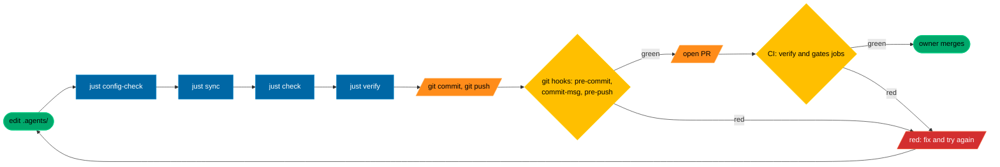

# Quickstart

How to get TAC running, and where to change things. For the full picture read [docs/DESIGN.md](docs/DESIGN.md); this page is the short way in.

## The one idea

TAC (toms-agent-config) is a harness for coding agents that works across providers. You describe how agents may work once, in the [`.agents/`](.agents/) tree. `tac sync` renders every harness's own files from it ([`AGENTS.md`](AGENTS.md), [`CLAUDE.md`](CLAUDE.md), [`.claude/`](.claude/), [`.codex/`](.codex/)) and records a hash of each in [`.agents/generated.lock`](.agents/generated.lock). `tac check`, the hook guard in every Claude and Codex session, the git hooks and CI then refuse anything that drifts from it. So: **edit `.agents/`, run `just sync`, and let the gates prove it.** The one file you start from is [`.agents/config.toml`](.agents/config.toml); every other TOML file under [`.agents/config/`](.agents/config/) is a table it points at.

## First ten minutes

You need git and [just](https://just.systems). `bootstrap.sh` installs uv if it is missing. Run these from the repository root, in order.

| Step | Command | What you should see |
|---|---|---|
| 1. Pin the CLIs (optional, needs [mise](https://mise.jdx.dev); skip it if you already have uv and just) | `mise trust && mise install` | uv and just at the versions in [`mise.toml`](mise.toml). |
| 2. Build both environments | `bash bootstrap.sh` (or `just setup`) | `==>` steps for uv, the candidate `.venv`, the deployed `.agents/.venv`, then a `tac doctor` run. Safe to rerun. Outside an agent session it also builds the runner's own venv. |
| 3. The full gate | `just verify` | actionlint, shellcheck, ruff, basedpyright, pytest and the private scan, all green (about three minutes). |
| 4. Health checks | `just doctor` | One `PASS`, `FAIL` or `UNKNOWN` line per named check, then `N of 18 checks pass`. **It exits non-zero on a fresh checkout**: `runner-pub` fails and `github-ruleset` shows `FAIL` or `UNKNOWN` until the owner-only steps in [TODO.HUMAN.md](TODO.HUMAN.md) are done; `client-claude`, `client-codex`, `trust-claude` and `trust-codex` fail until each CLI is installed and has trusted this folder; `hook-trust-codex` shows `UNKNOWN` while [`.codex/hooks.json`](.codex/hooks.json) holds hooks, since Codex runs a project hook only once it is approved by hash; inside an agent session `session-identity` can show `FAIL` or `UNKNOWN`, and `github-ruleset` and `session-identity` show `UNKNOWN` when your origin is a fork or a local clone. The rest should pass. |
| 5. The whole configuration | `just config-show` | About 300 lines of `key = value    # file:line`, every effective value and where it came from. |
| 6. One key, explained | `just explain profile.active` | The value, the file and line, when it applies and its comment. Try `just explain roles.chief` for a role's model, effort and launch command. |
| 7. Generated files are current | `just check` | `generated files match the lock`. |
| 8. Install the git hooks (**owner-run, on the host**, never in an agent session; once per clone) | `just hooks-install` | prek installs the pre-commit, commit-msg and pre-push hooks of [`hooks/git/prek.toml`](hooks/git/prek.toml) into this clone. From then on every `git commit` and `git push` runs them (see below). |

`just` on its own lists every recipe with a one-line description.

## How a change travels

Legend (the house subset of ISO 5807 in [docs/DESIGN.md](docs/DESIGN.md)): green stadium = start or end, blue rectangle = a step, yellow rhombus = a decision, orange parallelogram = input or output, red parallelogram = stop. Before you commit, run `just verify` and `just check` (which already includes `just pipeline-check`). Once `just hooks-install` has run, git runs the local share of this for you ([`hooks/git/prek.toml`](hooks/git/prek.toml), in the order `hooks.git.pre_commit`, `hooks.git.commit_msg` and `hooks.git.pre_push` name): pre-commit runs ruff format and check on the staged Python, `tac check --staged`, `tac human render --check` when `TODO.HUMAN.md` or `.human/` is staged, and the private scan; commit-msg holds the message to `standards.commits` and scans it for private terms; pre-push runs the fast tests (`-m 'not integration and not slow'`) and `tac check`. `git commit --no-verify` skips them; CI does not. CI's `verify` job runs the same lints, types and tests, then `tac check` and `tac pipeline check` from the deployed toolchain; `just verify` runs neither of those two, so a change can pass it and still fail CI. CI's `gates` job judges the pull request with the base revision's scripts (private scan, work orders, the floor, receipts). The CI file is [`.github/workflows/ci.yml`](.github/workflows/ci.yml).

Agent sessions cannot write `.agents/` ([`policy.paths.deny_write`](.agents/config/policy.toml)): the rendered sandbox and permission rules deny it, and the hook guard refuses the edit before the tool runs. Every path under it is owner-reviewed, so a change there is the owner's own edit through a pull request.

## Where to tweak

Every key below resolves with `just explain <key>`. A table name (such as `standards.commits`) prints every key under it. After any edit, `just config-check` first: unknown keys and wrong types fail loudly.

Every `.toml` file under `.agents/config/` (not the runner's public key), plus `.agents/config.toml`, `.agents/standards.floor.toml` and `.agents/context/`, is hashed in the lock. After any edit there, run `just sync` and then `just check`, even when nothing rendered changes, or CI's `verify` job fails.

Some keys are validated today but read by no code until a later milestone (M3 or later); the table says so where it applies. Changing one of those changes only the lock hash.

| I want to... | Edit | Key(s) | Then run |
|---|---|---|---|
| Change a role's model or effort | [`.agents/config/models.toml`](.agents/config/models.toml) | `models.roles.builder.anthropic.model`, `models.roles.builder.anthropic.effort` (same shape for `reviewer` and `manager`; `scout` on Anthropic has a model only, since Haiku 4.5 takes no effort; `.openai.` for Codex) | `just explain roles.builder`, `just sync`, `just check` |
| Turn the chief's ultracode on or off | [`.agents/config/models.toml`](.agents/config/models.toml) | `models.roles.chief.anthropic.ultracode`, `models.roles.chief.anthropic.effort` | `just explain roles.chief` (prints the launch command `just chief` uses), `just sync` |
| Change a board seat | [`.agents/config/models.toml`](.agents/config/models.toml), [`.agents/config.toml`](.agents/config.toml) | `models.directors.fable.model`, `governance.directors`. Each harness's director agent file takes that provider's lead seat, or its first seat when the provider has no lead: today `fable` for `.claude/agents/director.md` and `astra` for `.codex/agents/director.toml`. Changing `opus` changes no rendered file. What a builder or reviewer runs is `models.roles.<role>.<provider>.model` (row above); `models.providers.anthropic.build` is validated now but not rendered yet | `just config-check`, `just sync`, `just check` |
| Switch profile (enterprise, standard, yolo) | [`.agents/config.toml`](.agents/config.toml) | `profile.active` (only `standard` is supported in release 1; see the note below) | `just config-check`, `just sync`, `just check` |
| Adjust what a profile allows | [`.agents/config/profiles/standard.toml`](.agents/config/profiles/standard.toml) (also [`enterprise.toml`](.agents/config/profiles/enterprise.toml), [`yolo.toml`](.agents/config/profiles/yolo.toml)) | `profile.claude.defaultMode` (rendered into `.claude/settings.json`); `profile.loop` (`blocks_no_progress` stops a gate's repair reruns, `iterations` caps a headless stage's turns, `wall_minutes` its wall time), `profile.review` (`cross_provider` sends a review stage to the other provider) and `profile.local_checks` (passed to a gate that takes them) are read by `tac run` | `just config-check`, `just sync`, `just check` |
| Set the project kind and its gate pack | [`.agents/config.toml`](.agents/config.toml), [`.agents/config/gates/`](.agents/config/gates/) (for example [`tool.toml`](.agents/config/gates/tool.toml)) | `project.kind`, `gates.tool.checks` | `just config-check`, then each gate's recipe (for `tool`: `just gate-cli-smoke`, `just gate-wheel`); a pack's `argv` must name a recipe in the [`justfile`](justfile). Nothing checks that yet, so run each recipe once by hand. Then `just sync`, `just check` |
| Add or change a role | [`.agents/config/roles/`](.agents/config/roles/) (one file per role, for example [`builder.toml`](.agents/config/roles/builder.toml)) plus its `[roles.<name>]` table in [`models.toml`](.agents/config/models.toml) | `roles.builder.instructions`, `roles.builder.may`, `roles.builder.may_not` | `just config-check`, `just sync` (writes `.claude/agents/<role>.md` and `.codex/agents/<role>.toml` for each harness the role has a seat on in `models.toml`), `just check` |
| Change teams and who owns which paths | [`.agents/config/teams.toml`](.agents/config/teams.toml), [`.agents/config.toml`](.agents/config.toml) | `teams.core.owns`, `teams.core.max_workers`, `teams.core.skills`, `teams.max_local_agents`, `work.base` | `just config-check`, `just work-validate`, `just sync`, `just check` |
| Change project standards | [`.agents/config/standards.toml`](.agents/config/standards.toml) | `standards.versioning.scheme` (semver), `standards.changelog.format`, `standards.commits.convention`, `standards.commits.max_subject`, `standards.dates.format` (ISO 8601), `standards.diagrams.tool`, `standards.diagrams.flowcharts` (Mermaid norms), `standards.code.markdown.em_dashes`. A value looser than the floor in `.agents/standards.floor.toml` is not an error: the floor wins, and `just explain <key>` shows which file won. To go looser, change the floor, which the base check refuses. The commit-msg hook (`tac check --commit-msg`) enforces the commit keys: `standards.commits.convention`, `standards.commits.max_subject`, `standards.commits.trailers_required` (on a commit from an agent session) and, while `standards.code.markdown.em_dashes` is false, no em dash in the message. The other keys are validated, merged with the floor and shown by `just explain`; no hook checks a file against them yet | `just config-check`, `just explain standards.commits`, `just sync`, `just check`; try a message with `just check --commit-msg <file>` |
| Tighten the standards floor | [`.agents/standards.floor.toml`](.agents/standards.floor.toml) | `floor.commit_max_subject`, `floor.em_dashes`. A waiver (`[[waivers]]` naming a `gate`, `approved_by = "owner"`, an `expires` date) lifts that gate until the date; the commit-msg hook honours `commits` (the whole check), `commit_max_subject` and `trailers_required`, and `just config-check` refuses an expired or non-owner waiver. The base comparison does not refuse a waiver, the owner's review does | `just config-check origin/main` (refuses any floor key that loosens or disappears), `just sync`, `just check` |
| Change a pipeline | [`.agents/config/pipelines/`](.agents/config/pipelines/) (for example [`order.toml`](.agents/config/pipelines/order.toml)), [`.agents/config.toml`](.agents/config.toml) | `pipelines.enabled` (the pipelines whose files must exist; `just run <pipeline> <order>` runs only these). Stages themselves have no `explain` key. Removing a name from `enabled` does not turn a pipeline off: `just pipeline-check` still checks every file present. To remove a pipeline today, delete its file and its name from `enabled` | `just pipeline-check`, `just pipeline-plan order`, `just sync`, `just check` |
| Change what the hook guard checks in a session | [`.agents/config/hooks.toml`](.agents/config/hooks.toml) (the guard itself is [`hooks/run.py`](hooks/run.py), the checks are [`src/tac/hook.py`](src/tac/hook.py)) | `hooks.guard` (interpreter, PATH, deadline, timeout); one table per check, each with an `event`, a `kind` (deny, reminder or record) and a `claude` and `codex` tool matcher: `hooks.checks.owned-paths` (an edit outside the order's paths), `hooks.checks.secret-read` (a read of `policy.paths.deny_read`, the credential folders, the secrets folder or the controller store), `hooks.checks.generated-paths` (an edit to a generated file, `.agents/` or the controller store), `hooks.checks.handoff-guard` (Agent, Task and Workflow on Claude, spawn_agent on Codex), `hooks.checks.order-check` (a stop while the order's acceptance fails), `hooks.checks.spawn-record` (records only, from M3) | `just config-check`, `just sync` (renders them into [`.claude/settings.json`](.claude/settings.json) and [`.codex/hooks.json`](.codex/hooks.json)), `just check`. Sessions run the stamped `.agents/hooks/run.py`, so a change to `hooks/run.py` or `src/tac/` reaches them once the owner runs `just stamp-lib`; `just doctor` says when it has not: `hook-guard-current` for `hooks/run.py`, `agents-lib-current` for `src/tac/` |
| Change which git hooks run | [`hooks/git/prek.toml`](hooks/git/prek.toml) (the commands) and `[git]` in [`.agents/config/hooks.toml`](.agents/config/hooks.toml) (the ids, in order, per stage) | `hooks.git.pre_commit`, `hooks.git.commit_msg`, `hooks.git.pre_push` | `just sync`, then `just check` (refuses when the two files disagree, or a hook that is not a local command); the owner reruns `just hooks-install` on the host after changing which hook types prek installs |
| Answer a question on the owner's list | nothing by hand: [`TODO.HUMAN.md`](TODO.HUMAN.md) is rendered from [`.human/approvals/`](.human/approvals/) | none | `just human answer Q7 --text "..."` (records the answer under the item, closes a question or step and renders the page; `--basis` says how it arrived, `owner-via-chief` by default; `--keep-open` leaves it open), then `just human render --check` |
| Put a question, step or approval on the owner's list | nothing by hand; the sections and the fixed text of the page are [`.human/todo.toml`](.human/todo.toml) | none | `just human ask --kind question --topic governance --title "..." --question "..." --recommendation "..." --blocks "..." --waits M3` (`--kind step --topic steps` for a one-time task, which needs no recommendation, blocks or waits), then `just human render --check`. After editing `.human/todo.toml`: `just human render` |
| Ask for and give an approval | `.human/approvals/<id>.json`, written by `tac human ask --kind approval` | none | `just human ask --kind approval --topic approvals --question "..." --recommendation "..." --blocks "..." --waits M3 --tool ... --arguments '{...}' --revision <sha> --pr <n>` binds the action, its arguments and the revision. Only the owner's approving review on that pull request, or `just approve <id>` (owner only, on the host; refused in a sandbox or an agent session), counts; a ticked box does not. `just human verify <id>` exits 0 approved, 3 waiting, 4 rejected, 1 refused |
| Change the issue forms, labels or pull request template | [`.github/ISSUE_TEMPLATE/`](.github/ISSUE_TEMPLATE/) (for example [`work-order.yml`](.github/ISSUE_TEMPLATE/work-order.yml)), [`.github/labels.yml`](.github/labels.yml), [`.github/pull_request_template.md`](.github/pull_request_template.md), [`.agents/config/github.toml`](.agents/config/github.toml) | `github.issues.forms`, `github.issues.blank_issues`, `github.labels.families`, `github.labels.states` (a `team/*` label per team in `teams.toml`) | `just github-lint` (CI runs it too), `just sync`, `just check`; `just github-labels` prints the label plan, and `just github-labels --apply` is the owner's step on the host (S9 in [TODO.HUMAN.md](TODO.HUMAN.md)); it creates and updates, never deletes |
| Let a role start agents, or register a Workflow script | [`.agents/config/profiles/standard.toml`](.agents/config/profiles/standard.toml), a role file under [`.agents/config/roles/`](.agents/config/roles/), a stage in [`.agents/config/pipelines/`](.agents/config/pipelines/) | `profile.native_delegation` (`guarded`, or `off` to remove Agent, Task and Workflow from every session; refused while a role launches with ultracode), `roles.chief.delegates` (never true for builder, reviewer, manager or scout). A script is registered with `workflows = [".agents/workflows/<name>.js"]` on an agent stage of a delegating role (a chief stage, or the lead director's `design` stage); no key resolves for it | `just pipeline-check`, `just sync` (records the script's sha256 under `[workflows]` in the lock), `just check`. From M3 a Workflow call needs the runner's single-use token, which `tac run` issues for the stage it dispatches, bound to the script's hash. The owner's own chief session keeps Agent and Task as the recorded exemption, and a session the runner dispatched gets none without a token |
| Allow an MCP server | [`.agents/config/mcp.toml`](.agents/config/mcp.toml) | `mcp.servers`, `mcp.strict` (validated now; nothing renders MCP config yet, headless stages read it from M3) | `just config-check`, `just sync`, `just check`. A server is loaded only while the profile says `profile.mcp_servers = "from-conf"` (standard does); config-check refuses a profile with `mcp_servers = "none"` while `mcp.servers` lists a server (it would never load) and a profile with `"from-conf"` while `mcp.strict = false` (a headless stage would load your own user-level servers), for every profile file |
| Allow a host for agent commands | [`.agents/config/network.toml`](.agents/config/network.toml) | `network.egress.allow` (rendered for Claude only; Codex command networking stays off) | `just sync` (renders the Claude sandbox's allowed domains), `just check` |
| Change what no agent may read, write or do | [`.agents/config/policy.toml`](.agents/config/policy.toml) | `policy.paths.deny_read`, `policy.paths.deny_write`, `policy.effects.owner_only` | `just sync`, `just check`; the change is the owner's own edit under CODEOWNERS review (an agent proposal to loosen policy is what `governance.board_triggers` sends to the board) |
| Change which receipts a PR must carry | [`.agents/config/receipts.toml`](.agents/config/receipts.toml), [`.agents/config/probes.toml`](.agents/config/probes.toml) | `receipts.required`, `receipts.stages.verify`, `probes.version` | `just config-check`, `just sync`, `just check`; CI reads the base revision's copy, so it applies from the next pull request |
| Change runtime folders and passed-through variables | [`.agents/config/runtime.toml`](.agents/config/runtime.toml) | `runtime.paths.worktrees`, `runtime.env.pass` (read by `tac launch`: the only variables, besides each client's own, a launched session inherits) | `just config-check`, `just sync`, `just check` |
| Change the agents' GitHub identity | [`.agents/config.toml`](.agents/config.toml) | `governance.agent_identity` (the machine account `tac github apply` and `tac doctor` check). In [`.agents/config/github.toml`](.agents/config/github.toml), `[labels]` and `[issues]` are read by `just github-lint` (row above) and the rest is validated but not yet read; the merge method is fixed at squash, and the ruleset itself is built in [`src/tac/github.py`](src/tac/github.py) | `just config-check`, `just sync`, `just check`; the ruleset is applied by the owner on the host (`just github-apply`, see [TODO.HUMAN.md](TODO.HUMAN.md)), then `just doctor` |
| Change usage limits or which harnesses are enforced | [`.agents/config.toml`](.agents/config.toml) | `harnesses.enforced`, `harnesses.instructions_only`; `usage.*` (`usage.claude.slow_at`, `usage.claude.stop_at`, `usage.max_age_s`) is read by `tac usage` for each enforced harness's provider, and every dispatch checks it first: stop or no fresh reading pauses the stage | `just config-check`, `just sync`, `just check` |
| Change the prompt a handoff sends | [`templates/handoffs/`](templates/handoffs/) (for example [`build.md.j2`](templates/handoffs/build.md.j2)); schemas in [`contracts/handoffs/`](contracts/handoffs/) | none: the first line names the contracts it reads and writes, and must agree with the pipeline stage | `just pipeline-check`, `just test-one tests/test_handoff.py` |
| Change what each harness gets | [`templates/adapters/claude/`](templates/adapters/claude/), [`templates/adapters/codex/`](templates/adapters/codex/), [`templates/adapters/common/`](templates/adapters/common/) | none: the first line of each template names its output, which must be on the `ALLOWED` list in [`src/tac/sync.py`](src/tac/sync.py) (a new output path is a `src/tac/` change) | `just sync`, `just check` |
| Change the context every agent reads | [`.agents/context/brief.md`](.agents/context/brief.md) (the body of `AGENTS.md`), [`.agents/context/claude.md`](.agents/context/claude.md) (Claude-only notes in `CLAUDE.md`) | none | `just sync`, `just check` |
| Add or change a skill | [`.agents/skills/`](.agents/skills/) (one folder with a `SKILL.md`, for example [`work-order`](.agents/skills/work-order/SKILL.md)) | `teams.core.skills` gives it to a team; a pipeline stage's `skills` list gives it to a stage | `just sync` (links it into `.claude/skills/`), `just pipeline-check` |
| Give a builder ponytail, or another opt-in skill | [`.agents/config/pipelines/order.toml`](.agents/config/pipelines/order.toml) (the `skills` list of the `build` stage; a skill whose frontmatter carries `metadata.opt_in: true` is never linked into `.claude/skills/` and is injected only where a stage names it) | `stages[].skills` | `just skills-lint`, then `just check` |
| Add or change a diagram | [`docs/diagrams/`](docs/diagrams/) (one `.mmd` per lifecycle and per enabled pipeline, the house subset in [`docs/diagrams/README.md`](docs/diagrams/README.md)) | `github.diagrams.lifecycles`, `github.diagrams.per_pipeline` in [`.agents/config/github.toml`](.agents/config/github.toml) | `just diagrams-render` (needs node, refreshes `render.lock`), then `just diagrams-check` |
| Change the work order templates | [`work/templates/`](work/templates/) (the goal, report, review and sign-off files you copy by hand; [`work/orders/example/`](work/orders/example/) is the reference order) | none. The `order.toml` that `just work-new` writes comes from `ORDER_TEMPLATE` in [`src/tac/work.py`](src/tac/work.py); changing it is a change to `src/tac/`, which the owner then stamps | `just work-validate` |
| Run a pipeline | nothing to edit: the stages are [`.agents/config/pipelines/`](.agents/config/pipelines/), the state lives in the controller store | `pipelines.enabled`; a gate with `waits_on` keeps its pipeline from running (the shipped `order` waits on its local checks recipe) | **Owner-run, on the host**: `just run order <id>` (add `--entry issue=<file>` for the entry payload), `just run order <id> --resume <run>` after an approval or a fix (a publish that failed after your approval resumes with the same approval), `just run order <id> --dry-run` to see the stage order. Exits 0 complete, 3 waiting on you, 4 blocked |
| Start a role session the way the runner does | [`.agents/config/models.toml`](.agents/config/models.toml), [`.agents/config/runtime.toml`](.agents/config/runtime.toml) | `models.roles.chief.anthropic.effort`, `runtime.env.pass` | `just launch claude --role chief` (compares the generated files with the lock at origin/main first; `--allow-drift` only interactively), `just launch codex --role builder --print` to see the command without starting it |
| Feed the usage reading | your Claude Code statusline command (user settings, outside this repository) | `usage.max_age_s` | Make the statusline command pipe its stdin into `uv run --frozen --no-sync --project .agents tac usage record --provider claude`, then `just usage`. Codex has no documented statusline shape yet, so its reading stays unavailable and a Codex stage waits |
| Move the runner key into the keychain | nothing to edit | none | **Owner-run, on the host**, once: `just runner-keychain` (moves the signing key file into the login keychain, asks for the tac-bot token, removes the file), then restart the runner; Q24 in [TODO.HUMAN.md](TODO.HUMAN.md) |
| Cap what a stage prompt gets from memory | [`.agents/config.toml`](.agents/config.toml) | `memory.select_cap_chars` (the most memory text one stage prompt receives), `memory.retention_days` (read by the 1.1 fold job; nothing is deleted) | `just config-check`, then `just select --stage build --order <id>` (prints the selected lines of this repository's records, the origin remote's or `--repository owner/name`; `--json` adds the ids, their content hashes and the selector version) and `just memory-lint`. A mandatory record, one whose topics include `policy`, that does not fit the cap is a refusal naming it, never a truncation |
| Add, search or promote a memory record | nothing by hand: records are written by `just memory add`, promoted by `just memory promote` on the host or by the runner, indexed by `just memory index`; the promoted files under [`.agents/memory/`](.agents/memory/) are never hand-edited | none | `just memory add --kind decision --scope project --topic harness.config --statement "..." --launch <launch record>` (provider, harness, model, effort and role come only from the launch record; typing one into the payload is refused), `just memory search --text knob`, `just memory promote <id> --evidence receipt:<path>` (or `review:<order>`, `approval:<id>`; refused in an agent session, without a verified test-receipt, reviewed or owner basis, while the record is in conflict or superseded, or when the secrets scan finds anything), then `just memory index` and `just memory-lint`. These recipes run the stamped checker, so they work once the owner has run `just stamp-lib`; until then use `uv run --frozen tac memory ...` |

Two notes on profiles. Release 1 supports the `standard` profile only; `enterprise` and `yolo` arrive in release 1.1 ([ADR 0002](docs/adr/0002-owner-decisions-2026-09-25.md)). Both run agents in a container, so `just config-check` and `just sync` refuse either as the active profile unless the process runs inside one, proven by a root-owned marker file (`/.dockerenv` or `/run/.containerenv`), never by an environment variable. On your own machine, stay on `standard`. Inside a container, `enterprise` is also refused while any role launches with ultracode, since its `native_delegation = "off"` would leave ultracode no way to start its workflows: take ultracode off [`.agents/config/models.toml`](.agents/config/models.toml) first (drop `ultracode = true` on the chief and set the directors' `launch_effort` to `xhigh`). Its render then sets `defaultMode` to `default` (a prompt for every edit), denies `Agent`, `Task` and `Workflow` (no subagents or workflows), and drops `disableBypassPermissionsMode`.

## Do not hand-edit

| Path | Why | Change it by |
|---|---|---|
| [`AGENTS.md`](AGENTS.md), [`CLAUDE.md`](CLAUDE.md), [`.claude/settings.json`](.claude/settings.json), [`.claude/agents/`](.claude/agents/), [`.codex/config.toml`](.codex/config.toml), [`.codex/hooks.json`](.codex/hooks.json), [`.codex/agents/`](.codex/agents/) | Rendered by `tac sync`, listed under `[outputs]` in [`.agents/generated.lock`](.agents/generated.lock). `just check` fails on a hand edit. | Editing `.agents/` or `templates/adapters/`, then `just sync`. |
| [`.agents/generated.lock`](.agents/generated.lock) | Written by `tac sync`: the hash of every input, template and output. | `just sync`. |
| [`.agents/lib/tac/`](.agents/lib/tac/), [`.agents/hooks/run.py`](.agents/hooks/run.py) | The stamped copies of [`src/tac/`](src/tac/) and of the guard [`hooks/run.py`](hooks/run.py) that the deployed checker and every rendered hook run from. | Changing `src/tac/` or `hooks/run.py`; the owner refreshes the copies on the host with `just stamp-lib`. |
| [`TODO.HUMAN.md`](TODO.HUMAN.md) | Rendered by `tac human render` from [`.human/approvals/`](.human/approvals/) and [`.human/todo.toml`](.human/todo.toml). `just human render --check` and the pre-commit hook fail on a hand edit. | `just human ask` or `just human answer <id>`; the fixed text and sections in `.human/todo.toml`, then `just human render`. |
| [`.human/approvals/`](.human/approvals/) | One JSON file per item, written by `tac human ask` and `answer` and signed by `tac approve`; a hand-edited approval is not a verified answer. | The `just human` and `just approve` commands above. |
| [`contracts/config/`](contracts/config/), [`contracts/envelope.schema.json`](contracts/envelope.schema.json), [`contracts/human-item.schema.json`](contracts/human-item.schema.json), [`contracts/human-approval.schema.json`](contracts/human-approval.schema.json), [`contracts/hook-verdict.schema.json`](contracts/hook-verdict.schema.json), [`contracts/receipt.schema.json`](contracts/receipt.schema.json) | JSON Schemas generated from the models in [`src/tac/`](src/tac/); every config file is held to them. | Changing the model in `src/tac/`, then `uv run --frozen tac config schema --write`, `uv run --frozen tac handoff schema --write`, `uv run --frozen tac human schema --write`, `uv run --frozen tac hook schema > contracts/hook-verdict.schema.json` or `uv run --frozen tac receipt schema > contracts/receipt.schema.json` (`tac` is not on your PATH; `uv run` finds it). A new config key takes two pull requests: the checker change first (the owner then runs `just stamp-lib`), the key in the next, because `just config-check` and CI judge with the stamped or base checker. The handoff contracts under [`contracts/handoffs/`](contracts/handoffs/) are authored, but [`tests/test_contracts.py`](tests/test_contracts.py) holds each to the strict subset Codex accepts. |
| `.claude/skills/` | Links to `.agents/skills/`, rebuilt by `tac sync`, which removes anything else there; not committed. | Add or edit the skill under [`.agents/skills/`](.agents/skills/), then `just sync`. |
| [`CHANGELOG.md`](CHANGELOG.md) | Assembled at release time. | A fragment `changelog.d/<slug>.<type>.md` (see [changelog.d/README.md](changelog.d/README.md)); `just changelog` previews it. |
| [`.agents/memory/records/`](.agents/memory/), `.agents/memory/events/`, [`.agents/memory/_index/`](.agents/memory/_index/) | Written by `tac memory promote` (records and the events about them), `tac memory event` (events in the live journal, copied here on promotion) and `tac memory index` (the index, derived from the records and events). `just memory-lint` fails on a hand edit to the index, a record whose content hash does not match, or a sequence gap. | `just memory add`, `just memory promote <id> --evidence ...`, then `just memory index`. |

Owner-reviewed paths: [`.github/CODEOWNERS`](.github/CODEOWNERS) sends a change to the checker, its policy or its wiring to the owner's review. That includes everything under `.agents/`, `src/tac/`, `hooks/`, `templates/`, `contracts/`, `.claude/`, `.codex/`, `.github/` and `scripts/`, and the files `AGENTS.md`, `CLAUDE.md`, `justfile`, `pyproject.toml`, `uv.lock`, `bootstrap.sh`, `mise.toml` and `.python-version`; the file itself is the full list. Documentation such as this file is reviewed under the ordinary rules.

## Checks that tell you it worked

| Command | Passes when |
|---|---|
| `just config-check` | Every file loads and cross-checks: `config holds: profile standard, kind tool, ...`. Add a base (`just config-check origin/main`) to prove the floor only tightened. |
| `just check` | Every generated file matches a fresh render and the lock, and the pipelines, handoff templates, contracts and the AGENTS.md size budget pass (`just check --staged` judges what a commit would hold). |
| `just explain <key>` | The key exists and shows the value you meant; an unknown key exits 1 and suggests near names. |
| `just config-show` | You can see your new value next to the file and line it came from. |
| `just verify` | Lint, types, tests and the private scan are green. |
| `just pipeline-plan <name>` | The stages print in the order a run would take; nothing runs. `just pipeline-check` says the pipelines are sound. |
| `just work-check <id>` | An order changed only its own files and every acceptance command passes. |
| `just human render --check` | `TODO.HUMAN.md` is exactly the render of `.human/`. |
| `just github-lint` | The issue forms, the labels and the pull request template agree with each other, with `github.toml` and with the teams. |
| `just check --commit-msg <file>` | A commit message meets `standards.commits`, as the commit-msg hook judges it. |
| `just adapter-proof` | The launch and guard-failure tests pass with nothing skipped, and both clients' launch commands print. |
| `just skills-lint` | Every skill under `.agents/skills/` has a `name` equal to its folder, a description under 1,024 characters, a body under 500 lines, only specification fields, provenance in `metadata`, and the descriptions together fit the listing budget. |
| `just diagrams-render` | One SVG per inventory entry renders with the pinned mermaid-cli, every fenced mermaid block in `docs/` renders too, and `docs/diagrams/render.lock` is refreshed. |
| `just diagrams-check` | The inventory matches `github.toml` and every `.mmd` hashes to what `render.lock` recorded, so no diagram changed since it was last rendered. |
| `just usage` | Each enforced provider reads `ok` or `slow`; it exits 3 while one reads `stop` or `unavailable`. |
| `just inbox-watch --once` | Every request in the worker inbox has an outcome line in `inbox.done.jsonl` (owner-run, on the host). |
| `just memory-lint` | Every record and event in the live journal and in `.agents/memory/` parses, the index matches the records, no secret-like line and no sequence gap. |

## Where to go next

- [README.md](README.md): what TAC is, in one screen.
- [docs/DESIGN.md](docs/DESIGN.md): the full design, including the milestones (section 18).
- [docs/BOARD.md](docs/BOARD.md): how the design was decided.
- [work/README.md](work/README.md): work orders, teams and the `just work-*` recipes.
- [TODO.HUMAN.md](TODO.HUMAN.md): the owner's open decisions and one-time steps, rendered from [`.human/`](.human/).
- [docs/adr/](docs/adr/): the decision records.
