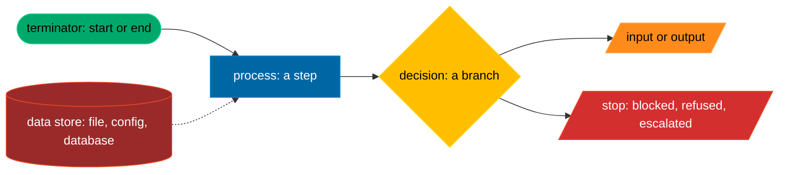

# Diagrams

Every diagram in this repository is a Mermaid flowchart in a house subset of the [ISO 5807:1985](https://www.iso.org/standard/11955.html) flowchart symbols: six shapes, one palette colour each, and a legend. Architecture views follow [ISO/IEC/IEEE 42010:2022](https://www.iso.org/standard/74393.html), with C4 context, container and component views as the presentation. The conventions block at the top of [DESIGN.md](../DESIGN.md#diagram-conventions) is the same table; [ADR 0004](../adr/0004-diagrams-house-subset-and-render-loop.md) records why. The `mermaid-diagrams` skill ([SKILL.md](../../.agents/skills/mermaid-diagrams/SKILL.md)) teaches it to an agent.

## The inventory

This folder holds exactly one source per lifecycle and one per enabled pipeline, as [github.toml](../../.agents/config/github.toml) `[diagrams]` and [config.toml](../../.agents/config.toml) `[pipelines] enabled` list them. `tac check` and `just diagrams-check` refuse a missing or an extra file.

| Source | What it shows | Drawn from |
|---|---|---|
| [lifecycle-init.mmd](lifecycle-init.mmd) | a clone becomes a checkout every harness obeys | DESIGN section 13 |
| [lifecycle-sync.mmd](lifecycle-sync.mmd) | `tac sync` renders, `tac check` judges against the lock | DESIGN sections 2.3 and 12 |
| [lifecycle-hook.mmd](lifecycle-hook.mmd) | one client event through the stamped guard | DESIGN sections 9 and 10 |
| [lifecycle-memory.mmd](lifecycle-memory.mmd) | a record from the live journal to a stage prompt | DESIGN section 6 |
| [lifecycle-board.mmd](lifecycle-board.mmd) | how the board decides a question | DESIGN sections 4 and 5 |
| [lifecycle-human-loop.mmd](lifecycle-human-loop.mmd) | a question for the owner and the resumed stage | DESIGN section 7 |
| [lifecycle-release.mmd](lifecycle-release.mmd) | fragments to a tag to a new judge on the host | DESIGN sections 13 and 18 |
| [pipeline-order.mmd](pipeline-order.mmd) | the `order` pipeline, stage by stage | [order.toml](../../.agents/config/pipelines/order.toml) |
| [pipeline-board.mmd](pipeline-board.mmd) | the `board` pipeline | [board.toml](../../.agents/config/pipelines/board.toml) |
| [pipeline-review.mmd](pipeline-review.mmd) | the `review` pipeline | [review.toml](../../.agents/config/pipelines/review.toml) |
| [pipeline-release.mmd](pipeline-release.mmd) | the `release` pipeline | [release.toml](../../.agents/config/pipelines/release.toml) |
| [pipeline-retro.mmd](pipeline-retro.mmd) | the `retro` pipeline | [retro.toml](../../.agents/config/pipelines/retro.toml) |

A pipeline diagram shows exactly its stages and gates in dependency order: an agent stage as a process, a gate as a decision, the owner's stage as an input, an escalation as a stop.

## The house subset

| Shape | Mermaid | ISO 5807 meaning | Class | Colour |
|---|---|---|---|---|
| Stadium | `id(["text"])` | terminator: start or end | `term` | green `#00A86B` |
| Rectangle | `id["text"]` | process: a step | `proc` | blue `#0067A5` |
| Rhombus | `id{"text"}` | decision: a branch | `dec` | yellow `#FFBF00` |
| Parallelogram | `id[/"text"/]` | input or output | `io` | orange `#FF8C1A` |
| Cylinder | `id[("text")]` | data store: file, config, database | `store` | dim red `#9A2A2A` |
| Parallelogram, red | `id[/"text"/]` | stop: blocked, refused, escalated | `stop` | red `#D32F2F` |

Every source pastes this classDef block verbatim and gives each node one class on a `class` line:

Legend: green terminator, blue process, yellow decision, orange input or output, dim red data store, red stop.

The rules `tac diagrams check` holds every `.mmd` here to:

- **Six shapes only.** A node drawn with any other bracket (a circle, a hexagon, a subroutine, an asymmetric flag) or with the `id@{ shape: ... }` syntax is refused, and so is a shape with the wrong class for it. Every node is drawn once with its shape and label; an id that edges only refer to is refused, and so is a line the lint cannot read as nodes and edges.
- **Every node has a class**, and every classDef is the palette's, character for character. No inline `style`.
- **Labels are quoted**, line breaks are ` `, `<` and `>` are written `&lt;` and `&gt;`.
- **The dotted edge.** A dotted edge (`-.->`) means read-only access: the node at its tail is read and never written. Every other relation is a solid edge.
- **The legend.** A `.mmd` source carries a `%% Legend:` comment naming each class it uses, in the words of the table (`green terminator`, `blue process`, and so on). A diagram in a Markdown file is followed by a `Legend:` line in the same words.
- **No em dash**, anywhere.

Dates in file names are ISO 8601 in the basic form, `20260925` or `20260925T1425Z`; dates in text are the extended form, `2026-09-25`.

## Rendering: the pinned loop

`just diagrams-render` runs `tac diagrams render`: for every `.mmd` here and every fenced mermaid block in a Markdown file under `docs/`, it runs `npx --yes @mermaid-js/mermaid-cli@<pinned>` with the version [mise.toml](../../mise.toml) pins under `[tools]`, one SVG per source into a scratch folder, and stops at the first failure. Then it writes [render.lock](render.lock): the mermaid-cli version and the sha256 of every source it rendered. It needs node 22.13 or later and, on the first run, the network (mermaid-cli fetches a headless browser).

No SVG is committed: renders differ between versions and machines, so the lock binds the sources to the last successful render instead. `just diagrams-check` (and `tac check`, and `tests/test_diagrams.py`) compares the sources to the lock without node, and names every source that changed, appeared or disappeared since. CI runs the same check on every pull request. The render itself runs locally with `just diagrams-render` until the owner decides how CI runs headless Chromium (TODO.HUMAN.md).

Rendering proves syntax only.

## The review checklist (ISO/IEC/IEEE 42010:2022)

The reviewer of any change that adds or changes a diagram answers each line in the review, with what they looked at:

1. **Stakeholders.** Who reads this diagram (the owner, an operator, a builder, a reviewer, an adopting project), and is it drawn for them?
2. **Concerns.** Which question of theirs does it answer (what runs when, what may write where, where a refusal happens, who decides)? One diagram, one concern.
3. **Viewpoint.** Which kind of view it is (a lifecycle, a pipeline, a trust boundary, a structure) and whether the conventions of that kind are kept: a pipeline shows exactly its stages and gates in dependency order; a lifecycle starts and ends at a terminator.
4. **View.** Does every node and edge match the source it was drawn from (the DESIGN section or the pipeline TOML named in its header)? Nothing missing, nothing invented, no stale name.
5. **Correspondence.** Where two diagrams show the same element, they name it the same way.
6. **Presentation.** For an architecture view, which C4 level it is (context, container or component), and it stays at that level. C4 is how it is drawn; 42010 is what it must answer.
7. **House subset.** Shapes, classes, the dotted-edge rule and the legend, as above. `just diagrams-check` proves the mechanics; the reviewer checks the meaning.
